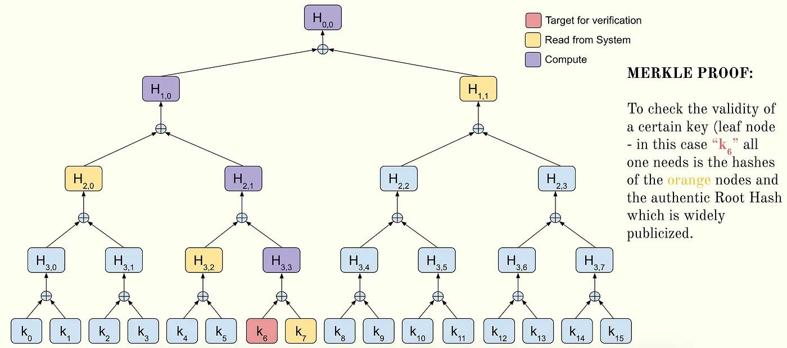

The problem of secure communication and digital contracts is fundamental to secure electronic data interchange.

<!-- more -->

## Centralised Key Distribution (Conventional)

In this method the two parties use conventional cryptographic keys for sending and receiving messages. However they have to find a suitable safe method to deposit their keys to the Central Agency without them being compromised.

## Simple Public Key Distribution

This method though better than conventional cryptography, suffers from a susceptibility to a man in the middle attack. Moriarty can hijack the communication by pretending to be Watson and convincing Holmes to use his (Moriarty’s) cryptographic key for sending messages.

Additionally, since the public keys are not deposited with a central authority, it cannot be used as a digital signature since Holmes can always repudiate a contract by refusing to accept ownership of his public key.

## Authenticated Public Key Distribution

To overcome the repudiation problem, a system of authentication of public keys is necessary. This also ensures communication integrity — neither party can alter a contract without the approval of the other.

This method therefore can be used for digital signatures.

Such authenticated public key distribution is what is used in SSH. However this method is also susceptible to the man in the middle attack. Another threat is that of the public key file being altered. SSH overcomes this to a certain extent using a list of known hosts.

## Certified Public Key Distribution

The mechanism to protect the public key file securely is to rely on a central certificate authority (whose public key is widely advertised), which manages the public key file.

This is the mechanism used in standard web certification like Tectia SSH and SSL / TLS — using X.509 certificates.

The risk here is of the private key of the Central Agency being compromised. To overcome this risk, the public key files can be appended to an immutable distributed ledger.

## Tree Authentication for Public Keys

This method does not require a secret private key for the Certificate Authority. This is accomplished by using a one way hash function over the entire public file arranged as a Merkle tree. Just by knowing the root hash (which is widely publicised), one can verify whether the public key tree file has been tampered with. This check can be done selectively for a certain key using Merkle’s tree authentication (Merkle Proof). For a public file with n keys, a client needs to fetch ln(n) hashes from the Distributed Authority and the authentic Root Hash for validation. The client also needs to compute ln(n) hashes including the computed Root Hash which it then compared to the reference Root Hash.

References:

R.C. Merkle — Protocols for Public Key Cryptosystems
