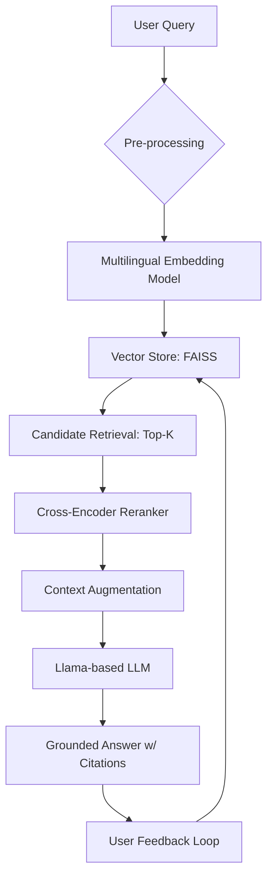

# Building the Enterprise Knowledge Fabric: From Scattered Data to Grounded Answers

In large-scale organizations, institutional knowledge is often "dark matter." It exists in wikis, Jira tickets, Slack threads and metadata catalogs, but finding it when you need it is a common bottleneck.

Over the past year, I led the engineering effort to build the **Enterprise Knowledge Fabric (EKF)**. EKF is an internal AI layer designed to turn fragmented data into trustworthy, cited answers. By leveraging Retrieval-Augmented Generation (RAG), we've created a system that helps teams find designs, policies, and operational details through a secure, conversational interface.

<!-- more -->

## The Architectural Blueprint

EKF isn't a single model; it’s a pipeline. We use a Llama-based LLM grounded by a high-performance retrieval engine to ensure that every response is backed by a "receipt" (a citation).

## Technical Deep Dive: Embeddings and Semantic Search

The "Search" component of RAG is where the battle for accuracy is won or lost. In EKF, we treat retrieval as a multi-stage optimization problem.

### Data Preparation and Chunking

Before data is vectorized, it must be "chunked." We found that large documents lose nuance when embedded as a single block. We implemented a **sliding window approach**:

- **Chunk Size:** ~512 tokens to match the context window of our transformer.
- **Overlap:** 10–15% overlap to ensure semantic continuity between chunks, preventing the "split-context" problem where an answer is sliced in half.

### Vectorization with SentenceTransformers

We utilize **SentenceTransformers** to map text into a high-dimensional dense vector space. This allows the system to understand that a query for _"How do I reset my credentials?"_ is semantically similar to a policy document titled _"Password Recovery Procedures."_

To ensure mathematical consistency during similarity search, we perform **unit-length normalization** on all vectors. This allows us to use the **Inner Product** as a proxy for **Cosine Similarity**, which is computationally more efficient.

The similarity between a query vector $q$ and a document vector $d$ is calculated as:

$$
\text{sim}(q, d) = \frac{q \cdot d}{\|q\| \|d\|}
$$

### High-Performance Retrieval with FAISS

For the vector store, we chose **FAISS (Facebook AI Similarity Search)**. At enterprise scale, a flat search (comparing the query to every single document) is too slow. We implemented:

- **IndexIVFFlat:** An inverted file index that partitions the vector space into Voronoi cells, significantly narrowing the search scope.
- **Top-K Retrieval:** We typically retrieve the top 10–20 candidates based on the highest similarity scores.

### The Reranker: Precision over Recall

Semantic search is great at _recall_ (finding relevant things) but can be noisy. To improve _precision_, we introduced a **Cross-Encoder reranker**. While the initial embedding search is fast, the Cross-Encoder performs a deeper, more expensive comparison between the query and the top-k candidates, re-sorting them so the most relevant context is fed to the LLM first.

## Global Reach: Multi-Language Support

Enterprises are rarely monolingual. To make EKF useful for our global offices, we had to solve the "cross-lingual retrieval" challenge.

### Cross-Lingual Embeddings

We transitioned from standard English-centric models to **Language-Agnostic BERT Sentence Embeddings (LaBSE)** and multilingual SentenceTransformers. These models are trained to map sentences from different languages into the same location in the vector space if they share the same meaning.

> **Example:** A query in German (_"Wie erstelle ich ein Ticket?"_) will cluster near the English documentation for _"How to create a ticket."_

### Translation vs. Native Generation

We experimented with two approaches:

1. **Translate-Translate:** Translating the query to English, retrieving English docs, and translating the answer back. (High latency, lost nuance).
2. **Native Multilingual RAG:** (Our Choice) Using multilingual embeddings to retrieve the best context regardless of language, then allowing the Llama-based LLM (which is natively multilingual) to generate the response in the user's original language.

This ensures that a French-speaking engineer can query an English design doc and receive a summary in French, complete with citations to the original source.

## Platform, MLOps, and Security

Scaling EKF required a robust cloud-native infrastructure.

- **Infrastructure:** We run on **GCP Kubernetes (GKE)**, using **Seldon Core** to manage our inference graphs.
- **State & Telemetry:** We use **Firestore** for per-user conversation history and **BigQuery** for telemetry. This allows us to track "search success rates" over time.
- **Observability:** **Prometheus** and **Grafana** monitor our P99 latency, ensuring the conversational interface feels snappy.
- **Security Guardrails:** We implemented **PII redaction** and **scoped access**. The system only retrieves documents the user has permission to see in the source system, preventing "privilege escalation" via AI.

## Feedback and Future Roadmap

The final piece of the Fabric is the feedback loop. Every response includes a "Thumbs Up/Down" mechanism. This telemetry isn't just for show; it drives our **Prompt Tuning** and helps us identify "knowledge gaps" where the LLM frequently fails to find an answer.

### What's Next?

- **Self-Hosted Llama:** Transitioning to a fully self-hosted instance for even stricter data residency requirements.
- **Agentic Search:** Moving beyond simple Q&A to allow EKF to perform actions, like automatically opening a support ticket if it can't find an answer in the docs.
