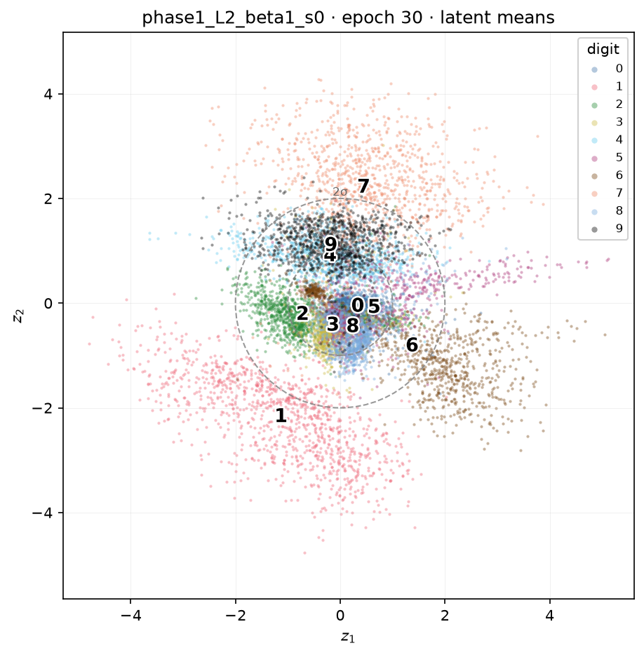
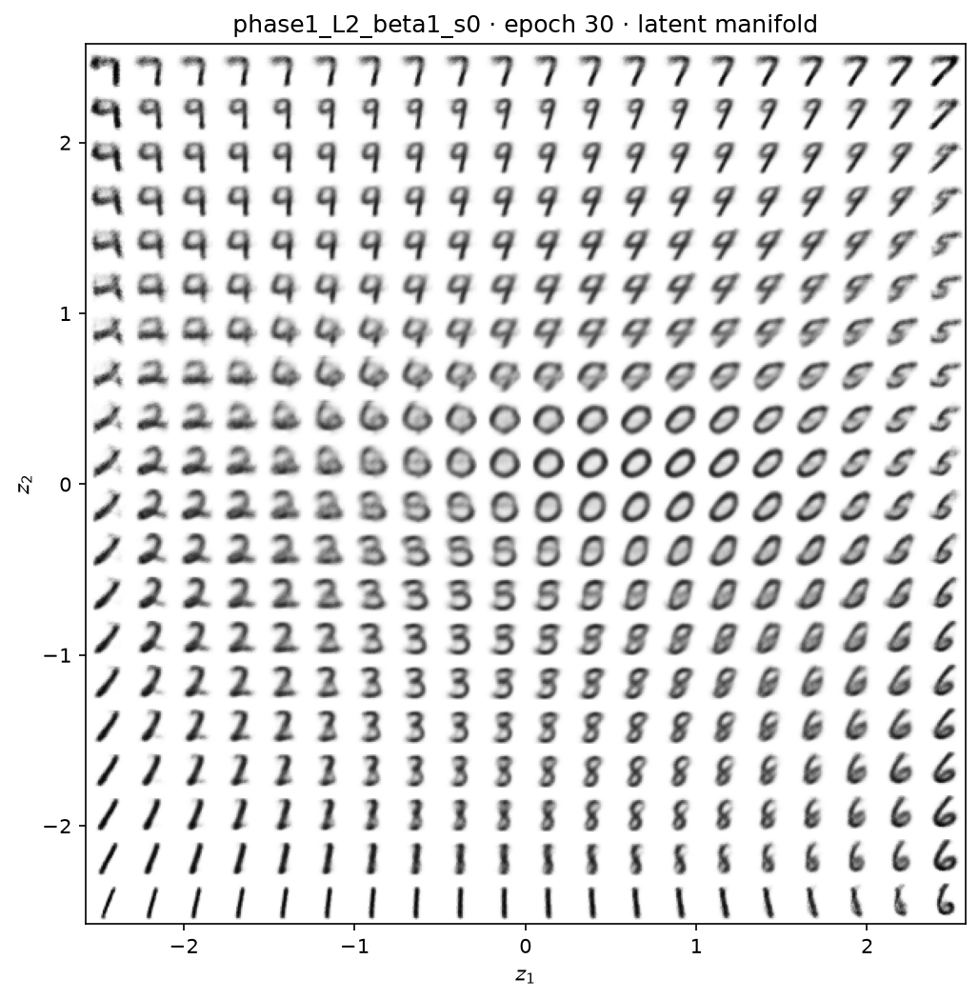
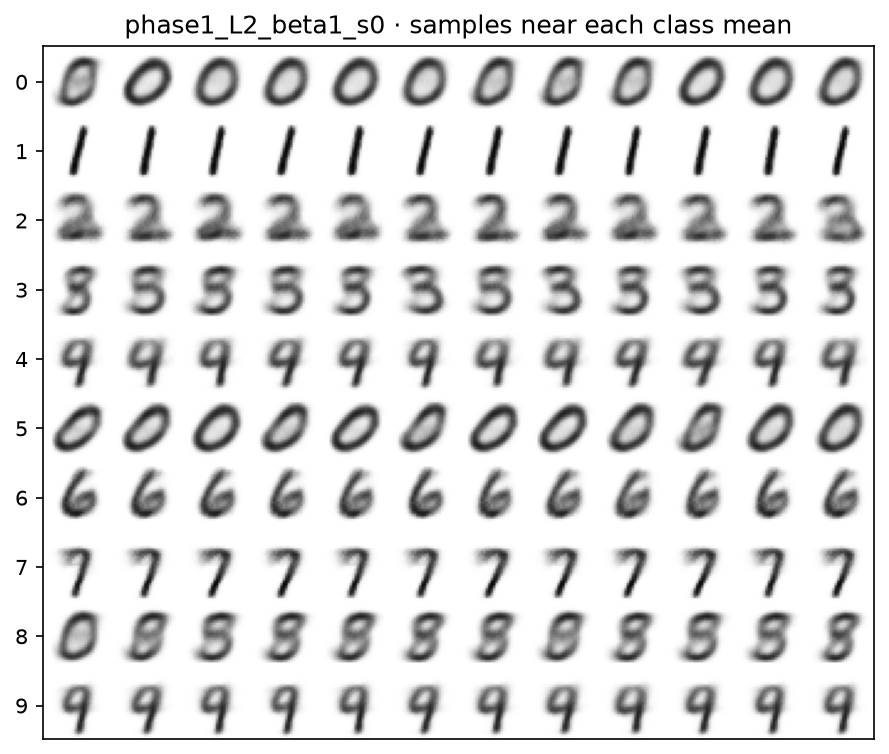
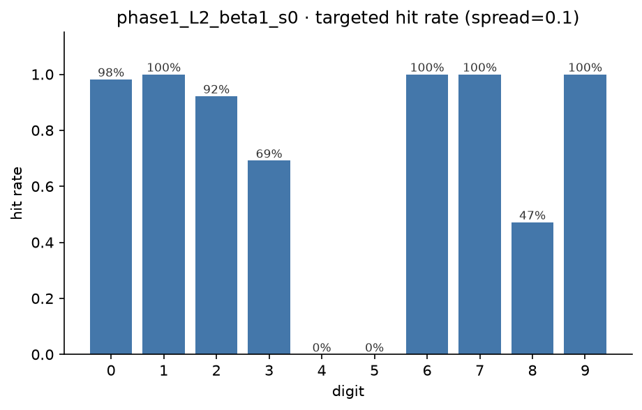
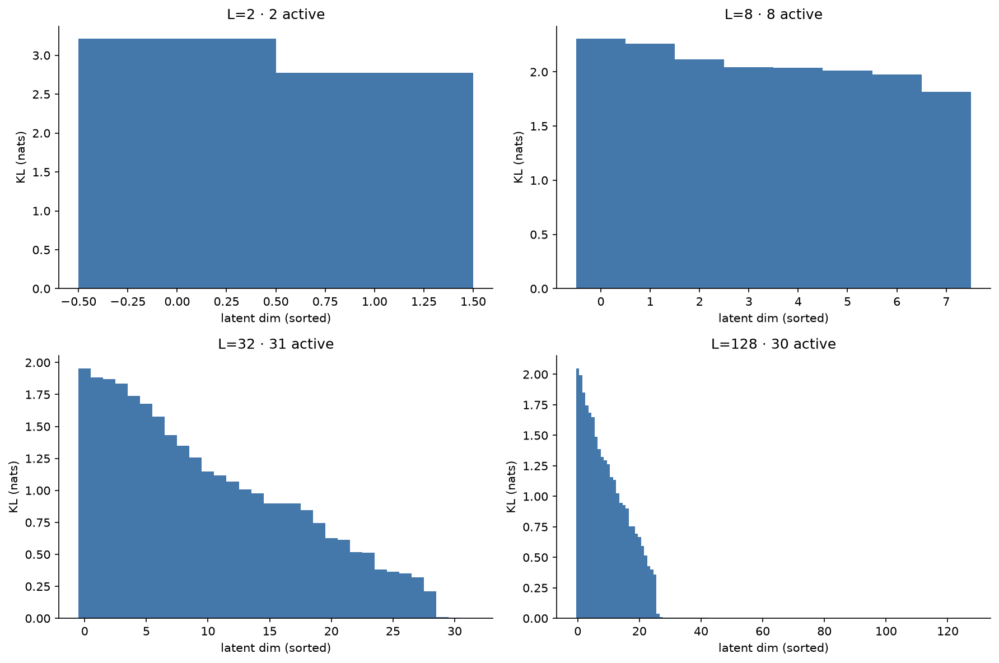
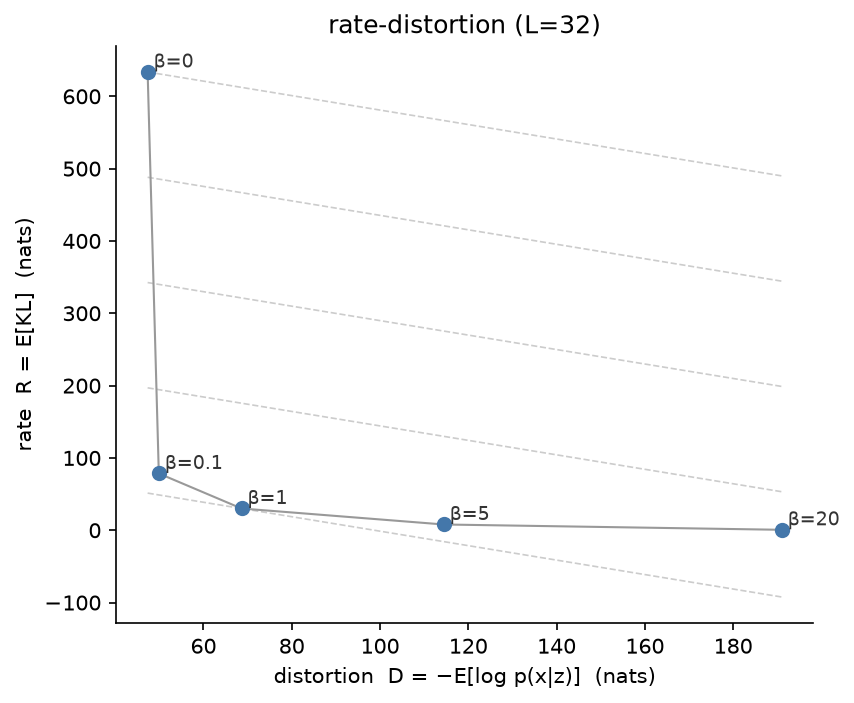
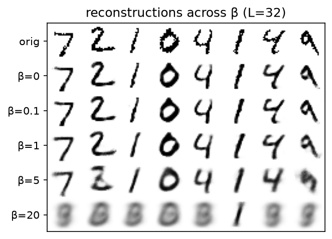
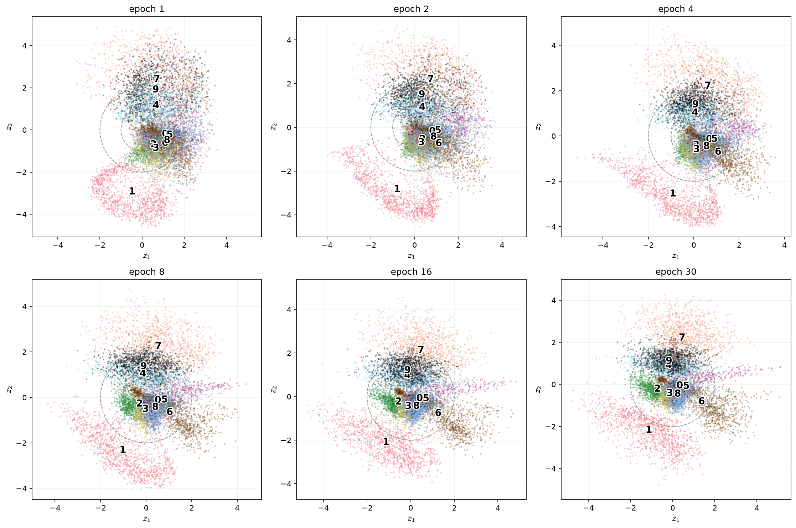

# Seeing Inside a VAE: Experiments in a 2D Latent Space

[Previously](2024-07-vaes.md) we had worked through the theory of the variational auto-encoder: the latent-variable motivation, the intractable marginal likelihood, and the ELBO with its two terms — a reconstruction term and a KL term that pulls the approximate posterior towards the prior. Here, rather than diving more into the equations, we try to figure what happens when we actually build the thing. To visualise things deliberately cripple it down to a **two-dimensional** latent space, and look at what it learned.

<!-- more -->

The reason to force just two latent dimensions is that two numbers can be plotted on a graph. Everything a normal VAE keeps hidden in a 32- or 128-dimensional code becomes a picture we can point at in 2D. The cost is a brutal bottleneck, the whole of a handwritten digit squeezed through two numbers and rebuilt.

## The setup

The model is as small as it can be while still being a VAE: an MLP encoder `784 → 400 → {μ, logvar}` with a two-dimensional latent, and a mirror-image decoder `2 → 400 → 784`. Trained on MNIST for 30 epochs at $\beta = 1$ (the honest ELBO), it reaches a test ELBO of about **−151 nats per image**.

One thing to hold onto throughout: **the model never sees the digit labels.** Its only objective is to compress each image and reconstruct it. Wherever a digit appears in what follows, the labels were attached *afterwards*, purely to colour the plots. Any structure we see is structure the model discovered on its own.

???+ info "The trap that ruins most MNIST VAEs"

    The reconstruction term must be *summed* over the 784 pixels and only then
    averaged over the batch. Use `reduction='mean'` and we silently divide it by
    784, the KL term dominates by three orders of magnitude, and the model
    collapses to blurry digit-averages. The tell is the loss at initialisation:
    it should read ~540 nats ($784 \cdot \ln 2$), not ~0.7.

## Seeing the latent space

The first experiment is the simplest. Encode all 10,000 test images, take each one's posterior mean $\mu$ (two numbers), and scatter them, coloured by the true digit.

Ten clusters, drawn by a model that was never told there were ten of anything. This is the moment the VAE "clicks": the compression objective alone — *pack these images into two numbers so you can rebuild them* — forces visually similar digits to nearby locations, and the classes fall out for free.

The overlaps are as informative as the separations. **7** and **1** sit in clean, distinct territory; **3/5/8/0** and **4/9** bleed into each other, because those digits genuinely look alike and the model, reasoning only from pixels, placed similar shapes together. Notice too that the points spill well outside the dashed circles marking the $1\sigma$ and $2\sigma$ contours of the $\mathcal{N}(0, I)$ prior. That gap — the aggregate posterior sitting wider than the prior says it should — is the **prior hole**, and it explains a failure we will hit shortly.

## The manifold

The scatter shows where real digits *land*. The complementary view is what the decoder *generates* everywhere else. Lay a grid across the latent plane, decode every point to an image, and tile the results.

This is "the manifold" everyone talks about, made literal — a continuous sheet on which every writable digit lives somewhere, with smooth morphs between neighbours and no hard boundaries. Not one of these little images is real; each is the decoder's answer to *if a digit lived at this coordinate, what would it look like?*

Two details worth reading off it. The clean, canonical digits sit toward the **periphery** (the interiors of the clusters), while the ambiguous blends sit in the **centre** — the crossroads where several clusters meet. That is counterintuitive until we remember the prior hole: the clusters were pushed *outward*, so the origin, which is where prior sampling is densest, is exactly where the least digit-like mush lives.

???+ info "Why not just space the grid evenly?"

    A naïve `linspace(-3, 3)` grid oversamples the tails, where the model saw
    almost no data, so the corners decode to garbage. Spacing the grid by the
    prior's inverse CDF instead gives each cell equal probability mass, which is
    why this tile is full of digits rather than blank in the corners.

## The mean of a class is not a member of the class

If the 3-cluster lives in one region and the 8-cluster in another, can we *generate* a chosen digit by sampling near its cluster's centre? Compute $\bar{\mu}_c$, the average latent position of every image of digit $c$, sample a tight cloud around it, decode, and check what comes out with an independent CNN classifier (99% accurate on its own).

Each row samples near one digit's centroid. Most rows are exactly what we'd hope — recognisable, consistent digits. But look at the rows for **4** and **5**.

The hit rate — the fraction of samples that actually come out as the target digit — is a clean 98–100% for 0, 1, 6, 7, 9, but **0% for 4 and for 5**. Not "poor", *zero*. The lesson is a general one that bites well beyond VAEs:

> The mean of a class need not be a member of the class.

The 4s form a crescent wrapped around the 9-region, so their average lands squarely in **9-territory**; sampling there produces 9s every time. The 5s average into the 3/8 tangle. Averaging is only a good summary when a class occupies a compact, convex region — and in a two-dimensional space starved for room, several classes simply don't. (It is worth being precise about what this is *not*: it is not conditional generation. The model still has no label input; we are fitting a crude Gaussian to where a class happened to land, which is a different and much weaker thing.)

## How many dimensions does MNIST actually need?

Two dimensions is a caricature. What happens with room to breathe? Training the same VAE at latent sizes $L \in \{2, 8, 32, 128\}$ and looking at the **per-dimension KL** — how much information each latent dimension carries — gives the single most revealing plot of the lot.

At $L = 128$, the model lights up roughly **30 dimensions and leaves the other ~98 at essentially zero** KL. Given 128 dimensions, it *refuses* to use most of them. This is the information bottleneck made visible: each active dimension costs KL but must earn that cost by improving reconstruction, and once the ~30 dimensions MNIST genuinely needs are used, the rest are pure overhead and get driven to the prior. The model chose its own dimensionality.

The numbers across the sweep tell the same story from another angle:

| L | test ELBO | active units | linear probe |
| --- | --- | --- | --- |
| 2 | −151 | 2 / 2 | 66% |
| 8 | −109 | 8 / 8 | 88% |
| 32 | −99 | 31 / 32 | 89% |
| 128 | −99 | **30 / 128** | 94% |

The ELBO plateaus by $L = 32$ — a 4× bigger latent buys nothing more, because the model was already using only ~30 dimensions. (The "linear probe" is the accuracy of a linear classifier trained on the frozen latent; at $L = 2$ it sits *below* a 91% raw-pixel baseline, a blunt reminder that aggressive compression can throw away exactly the information we might have wanted.)

## Compression versus reconstruction: the β knob

The KL term has a weight, $\beta$, and it is the dial on the whole enterprise. Holding $L = 32$ and sweeping $\beta$ traces out the **rate–distortion curve** — rate $R$ (the KL, the information pushed through the latent) against distortion $D$ (the reconstruction cost), both in nats.

Every $\beta$ is one operating point on a convex frontier; we cannot have both low rate and low distortion, and $\beta$ chooses where we sit. The reconstructions across the same sweep make it visceral:

Small $\beta$ gives sharp reconstructions; large $\beta$ smears digits toward blurry averages as the latent is abandoned. The two endpoints are each instructive failures:

- **$\beta = 0$** removes the KL brake entirely. Reconstruction is sharpest, but the latent now carries **634 nats ≈ 914 bits** to represent a **784-bit** image. That is not compression — it is *expansion*. Without the KL penalty the encoder makes ultra-precise, prior-mismatched codes; from a Shannon standpoint we would do better sending the raw pixels.
- **$\beta = 20$** over-penalises rate, and the latent **collapses** — active units fall from 31 to 2, and the reconstructions become near-identical mush regardless of the input.

The useful representation lives at the knee. $\beta = 1$ is exactly ELBO-optimal, compressing a 784-bit image down to about 30 nats of shared, generalisable structure.

???+ info "This is where Shannon meets the ELBO"

    $-\text{ELBO} = D + R$. The rate $R$ is literally the channel rate through the
    latent — the bits we would spend transmitting the code — and $D$ is the
    residual we must patch up afterwards. $\beta$ trades one against the other.
    This is the central figure of Alemi et al.'s *Fixing a Broken ELBO*.

## Watching features emerge

A final experiment, and my favourite. The 2D model was checkpointed on a log-spaced schedule, so we can replay the latent scatter across training and watch structure form.

Emergence is **not monotonic**, which surprised me. **1** and **7** — the most visually distinctive digits — resolve at the very first epoch and stay put; they are the easy features, learned first. The crowded middle (0/2/3/5/6/8) starts as an undifferentiated blob and separates slowly and only partially. And **4** and **9** appear cleanly separated *early*, then **re-entangle** as training proceeds: an early, crude arrangement gets overwritten as the model optimises globally under the two-dimensional constraint, sacrificing the 4/9 split (cheap to give up, since they look alike) to make room for the harder digits.

If we only looked at the final epoch, we would conclude "4 and 9 overlap because they're similar" — true, but we would miss that the model *tried* separating them and backed out. Features form, drift, merge, and sometimes vanish. That the training dynamics reorganise a representation rather than simply sharpening it is the whole reason the longitudinal view is worth keeping.

## What a representation keeps

Stepping back, the two-dimensional caricature answered the questions it was built to answer. A VAE keeps the handful of shared factors that let it rebuild the data — about thirty dimensions' worth for MNIST — and discards the per-instance detail as redundant. $\beta$ sets how ruthless that discarding is, and the interesting representations sit at the knee between hoarding everything and collapsing to nothing.

The obvious next question is whether a *different* objective, one with no reconstruction at all, keeps different things. That is the subject of the [following post on self-supervised learning](2026-08-05-self-supervised-learning.md): no decoder, no pixels to rebuild, just the constraint that two views of an image should agree — evaluated, as here, with a linear probe on the frozen representation. The same yardstick, a very different route.
