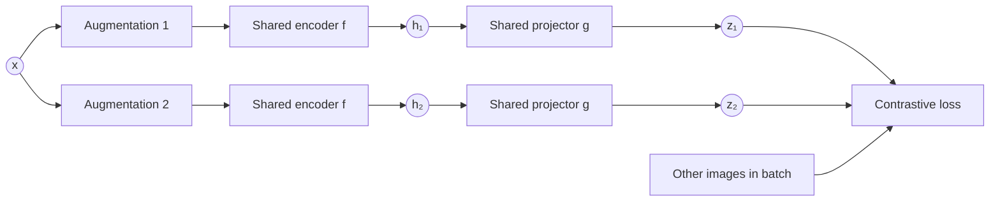
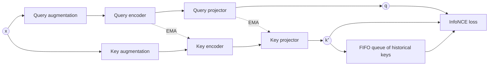
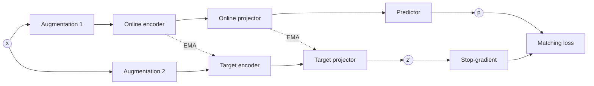
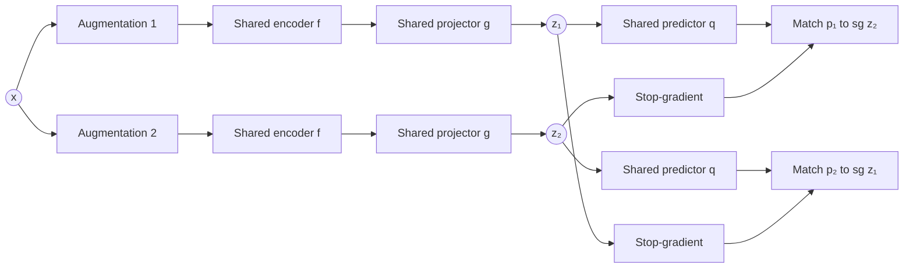

The central purpose of self-supervised representation learning is to train an encoder that extracts useful features from an image without requiring human-provided labels. The features, not the samples, are the product. 

<!-- more -->

The basic idea is to take one image and generate multiple transformed views of it through cropping, blurring, colour jitter, flipping or similar augmentations. The pixels may change considerably, but the underlying image identity does not. A useful encoder should therefore produce representations that are stable under these transformations: different views of the same image should map to similar representations, while independent images should remain distinguishable.

The difficulty is **representation collapse**. If the only objective were to make two views of the same image similar, the encoder could map every image to the same constant vector. Every pair would then match perfectly, but the representation would carry no information at all.

SimCLR, MoCo, BYOL and SimSiam are four different answers to this one problem.

## SimCLR: identify the matching view

SimCLR is a **contrastive** method. It prevents collapse by explicitly comparing each image against the other images in the minibatch.

!!! quote "Reference"

    Chen, Kornblith, Norouzi & Hinton (2020), [*A Simple Framework for Contrastive Learning of Visual Representations*](https://arxiv.org/abs/2002.05709), ICML.

For every original image $\mathbf{x}$, two random augmentations are drawn from a family $\mathcal{T}$:

$$
\mathbf{x}_1 = t_1(\mathbf{x}), \qquad \mathbf{x}_2 = t_2(\mathbf{x}), \qquad t_1, t_2 \sim \mathcal{T}
$$

Each view passes through the same two-stage neural network: an encoder $f$, usually a convolutional network, and a projection head $g$, usually a small multilayer perceptron.



The encoder produces $\mathbf{h} = f(\mathbf{x})$ and the projector produces $\mathbf{z} = g(\mathbf{h})$. The contrastive loss operates on $\mathbf{z}$, while $\mathbf{h}$ is retained as the representation for downstream applications.

For one anchor $\mathbf{z}_i$, the loss asks the model to identify its corresponding view $\mathbf{z}_j$ among all other views in the batch:

$$
\ell_{i,j} = -\log \frac{\exp \big( \text{sim}(\mathbf{z}_i, \mathbf{z}_j) / \tau \big)}{\sum_{k \neq i} \exp \big( \text{sim}(\mathbf{z}_i, \mathbf{z}_k) / \tau \big)}
$$

where $\text{sim}(\mathbf{u}, \mathbf{v}) = \mathbf{u}^\top \mathbf{v} / (\|\mathbf{u}\| \|\mathbf{v}\|)$ is cosine similarity and $\tau$ is a temperature.

???+ info "InfoNCE"

    This objective is the **InfoNCE** loss, which arises from noise-contrastive
    estimation. It is a softmax cross-entropy over a set of candidates in which
    the "correct class" is the matching view. Minimising it maximises a lower
    bound on the mutual information between the two views.

This is effectively a classification problem: *which of the available representations is the other view of this image?* The positive pair should have high similarity, while representations of independent images act as negatives.

If every input collapsed to the same vector, all similarities would be equal, the model could not identify the positive pair, and it would do no better than random guessing. Negatives therefore make total collapse incompatible with a low loss.

### Why separate the representation and the projection?

The contrastive objective encourages the model to suppress information affected by the augmentations. If colour jitter is used, for example, colour-sensitive information becomes inconvenient for the contrastive task. Applying that pressure directly to $\mathbf{h}$ could cause the reusable representation to discard information that is still useful downstream.

The projection head provides a disposable training space:

$$
\mathbf{x} \longrightarrow \mathbf{h} \longrightarrow \mathbf{z}
$$

The loss is evaluated on $\mathbf{z}$, which allows the projector to specialise in augmentation invariance while giving $\mathbf{h}$ room to remain richer. This separation is not mathematically guaranteed, since gradients still flow through both the projector and the encoder. But the architecture creates an inductive bias that lets the projector absorb some of the strongest pressure imposed by the objective.

After training, the projector is discarded and the encoder output $\mathbf{h}$ is used.

## MoCo: a queue of historical negatives

SimCLR obtains its negatives from the current minibatch, so using more negatives normally requires a larger batch and more GPU memory. **Momentum Contrast (MoCo)** keeps the contrastive objective but changes how negatives are supplied. It introduces two separate paths: a *query* encoder and projector, and a *key* encoder and projector.

!!! quote "Reference"

    He, Fan, Wu, Xie & Girshick (2020), [*Momentum Contrast for Unsupervised Visual Representation Learning*](https://arxiv.org/abs/1911.05722), CVPR.



For each image, the query is compared with one positive key generated from another view of the same image, and with a large queue $\mathcal{Q}$ of keys generated from previous minibatches. The loss has the same broad form as SimCLR:

$$
\mathcal{L} = -\log \frac{\exp \big( \text{sim}(\mathbf{q}, \mathbf{k}^+) / \tau \big)}{\exp \big( \text{sim}(\mathbf{q}, \mathbf{k}^+) / \tau \big) + \sum_{\mathbf{k}^- \in \mathcal{Q}} \exp \big( \text{sim}(\mathbf{q}, \mathbf{k}^-) / \tau \big)}
$$

The query must identify its positive key among the queued negatives. The queue operates on a first-in, first-out basis: new keys are appended after each step and the oldest are dropped. This decouples the number of negatives from the minibatch size, so that

$$
\text{number of negatives} \approx \text{queue length}
$$

rather than being tied to the batch size.

The query-side parameters $\theta_q$ are optimised by backpropagation. The key-side parameters $\theta_k$ receive no gradients; they are updated as an exponential moving average of the query-side parameters:

$$
\theta_k \leftarrow m \, \theta_k + (1 - m) \, \theta_q, \qquad m \in [0, 1)
$$

The key encoder therefore changes slowly. This matters because the queue holds keys generated during earlier iterations, and a rapidly changing key encoder would make old and new keys mutually inconsistent. Momentum updating keeps the queued representations approximately compatible.

MoCo does not eliminate the need for negatives. It provides a memory-efficient way to maintain a great many of them.

## BYOL: learning without negatives

**Bootstrap Your Own Latent (BYOL)** asks whether useful representations can be learned without explicitly pushing independent images apart. It has two paths: an *online* path updated by gradient descent, and a *target* path updated through an exponential moving average.

!!! quote "Reference"

    Grill et al. (2020), [*Bootstrap Your Own Latent: A New Approach to Self-Supervised Learning*](https://arxiv.org/abs/2006.07733), NeurIPS.



The online branch contains three learned modules, encoder $\rightarrow$ projector $\rightarrow$ predictor, while the target branch contains only encoder $\rightarrow$ projector. The online prediction is trained to match the target projection:

$$
\mathcal{L}_{\text{BYOL}} = \left\| \frac{\mathbf{p}}{\|\mathbf{p}\|_2} - \text{sg} \left( \frac{\mathbf{z}'}{\|\mathbf{z}'\|_2} \right) \right\|_2^2
$$

Here $\text{sg}(\cdot)$ denotes **stop-gradient**: the target representation participates in the loss but is treated as a constant during backpropagation.

The same loss updates the online encoder, projector and predictor. The target encoder and projector are not updated by the loss; they slowly follow their online counterparts through an exponential moving average, exactly as in MoCo. The process can be read as *a rapidly learning online network predicting the representation produced by a slowly moving target network*.

Fresh augmentations are drawn at each training step, so over time the online network learns to predict representations that remain stable across many different views of each image.

BYOL's central surprise is that this works without negatives. Collapse is avoided through the asymmetry between the two branches: stop-gradient prevents both sides from moving together within the same optimisation step, the predictor exists only on the online side, and the target network evolves slowly.

## SimSiam: stripping BYOL down to its essentials

**SimSiam** asks a natural follow-up question:

> Is the momentum target network actually necessary?

BYOL contains several candidate anti-collapse mechanisms:

- an online predictor;
- stop-gradient on the target branch;
- two separate parameter sets;
- an EMA target network.

SimSiam removes the momentum encoder and shows that useful representations can still be learned. Both views now pass through the **same shared encoder and projector**.

!!! quote "Reference"

    Chen & He (2021), [*Exploring Simple Siamese Representation Learning*](https://arxiv.org/abs/2011.10566), CVPR.



The two branches share parameters:

$$
\mathbf{x}_1 \rightarrow f \rightarrow \mathbf{h}_1 \rightarrow g \rightarrow \mathbf{z}_1, \qquad \mathbf{x}_2 \rightarrow f \rightarrow \mathbf{h}_2 \rightarrow g \rightarrow \mathbf{z}_2
$$

and a predictor is applied to each projection, $\mathbf{p}_1 = q(\mathbf{z}_1)$ and $\mathbf{p}_2 = q(\mathbf{z}_2)$.

Training is symmetric in value but asymmetric in gradient flow. In one direction the prediction from view 1 is matched to the stopped projection from view 2, and in the other direction the roles switch:

$$
\mathcal{L}_{1 \rightarrow 2} = D \big( \mathbf{p}_1, \text{sg}(\mathbf{z}_2) \big), \qquad \mathcal{L}_{2 \rightarrow 1} = D \big( \mathbf{p}_2, \text{sg}(\mathbf{z}_1) \big)
$$

The total loss averages the two:

$$
\mathcal{L} = \tfrac{1}{2} \big( \mathcal{L}_{1 \rightarrow 2} + \mathcal{L}_{2 \rightarrow 1} \big)
$$

where $D$ is typically the negative cosine similarity:

$$
D(\mathbf{p}, \mathbf{z}) = - \frac{\mathbf{p}}{\|\mathbf{p}\|_2} \cdot \frac{\mathbf{z}}{\|\mathbf{z}\|_2}
$$

### What stop-gradient changes

Consider the first direction, $\mathbf{p}_1 \rightarrow \text{sg}(\mathbf{z}_2)$. The value of $\mathbf{z}_2$ is used as the target, but no gradient flows through it, so within that loss term only the path producing $\mathbf{p}_1$ is changed. For the reverse term the roles switch. Each branch therefore alternates between two roles:

- predictor being optimised;
- fixed target for the other branch.

The network is shared, but the gradient paths are not symmetric within each loss term.

### How this differs from BYOL

BYOL maintains two parameter sets:

```text
Online network: updated by gradient descent
Target network: updated by EMA
```

SimSiam uses only one:

```text
Shared network: updated by gradient descent
Target output:  detached for each directional loss
```

There is therefore no momentum encoder, no EMA update, no queue and no negatives. The architecture is much simpler, yet it still avoids collapse.

### What does SimSiam reveal?

SimSiam demonstrates that a slowly moving teacher is not essential. The critical structure is the asymmetric prediction problem created by a predictor on the optimised side and a stop-gradient on the target side.

It is slightly too strong to say that stop-gradient by itself prevents collapse. In the SimSiam architecture, removing stop-gradient causes collapse, and the predictor is also an important part of the successful configuration. The safer conclusion is that predictor asymmetry and stop-gradient are together *sufficient* to learn useful representations without negatives or a momentum target.

The theoretical explanation remains subtle. A collapsed representation is still mathematically compatible with the matching objective; it is the optimisation dynamics created by the stop-gradient and the predictor that steer training away from that solution. The resulting progression is:

$$
\begin{aligned}
\text{BYOL} &= \text{predictor} + \text{stop-gradient} + \text{EMA target} \\
\text{SimSiam} &= \text{predictor} + \text{stop-gradient}
\end{aligned}
$$

## Four answers to the same problem

These methods are best understood as different answers to one question: *how can two views of the same image be made similar without mapping every image to the same representation?*

| Method | Negatives | Anti-collapse mechanism |
| --- | --- | --- |
| SimCLR | in-batch | contrastive loss over other images |
| MoCo | FIFO queue | contrastive loss plus momentum key encoder |
| BYOL | none | predictor, stop-gradient, EMA target |
| SimSiam | none | predictor, stop-gradient |

In every case the final product is the encoder representation $\mathbf{h}$. The projection heads, predictors, queues and momentum networks are training mechanisms used to shape that representation, and they are discarded once self-supervised training is complete.

???+ info "Evaluating a self-supervised encoder"

    The standard protocol is the **linear probe**: freeze the encoder, train a
    single linear classifier on $\mathbf{h}$ using labelled data, and report its
    accuracy. A good self-supervised representation makes the classes linearly
    separable, so the quality of $f$ can be measured without fine-tuning it.
