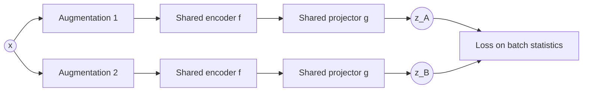

# Barlow Twins and VICReg: Regularising the Latent Space

The [previous post](2026-08-05-self-supervised-learning.md) framed self-supervised learning as a set of different answers to one problem: how to make two views of an image agree *without* mapping every image to the same constant vector — **representation collapse**. Contrastive methods (SimCLR, MoCo) answered from the *sample side*, using negatives to force independent images apart. Non-contrastive methods (BYOL, SimSiam) answered from the *optimisation side*, using a predictor and stop-gradient to make collapse dynamically unreachable. Barlow Twins and VICReg are a third family, and their answer is the most direct of the three: constrain the *statistics of the latent space* so that a collapsed representation is explicitly penalised.

<!-- more -->

The shift is worth stating plainly. The earlier families avoid collapse *indirectly* — through what you compare against, or through how gradients flow. Regularisation methods instead **write down what a healthy latent space should look like** and add it straight to the loss:

> Views of the same image should agree, latent dimensions should stay active, and different dimensions should carry different information.

The architecture is the plainest in the whole SSL zoo. Both views pass through the *same* encoder and projector — no predictor, no momentum encoder, no queue, no negatives. Everything distinctive lives in the loss, which is computed over the **statistics of a batch** of embeddings.



## Barlow Twins: make the cross-correlation matrix the identity

Barlow Twins draws two augmented views $x_A = t_A(x)$ and $x_B = t_B(x)$, embeds both to $z_A, z_B$, and — after standardising each embedding dimension along the batch — computes the **cross-correlation matrix** between the dimensions of the two views:

$$
C_{ij} = \frac{\sum_b z^A_{b,i}\, z^B_{b,j}}{\sqrt{\sum_b (z^A_{b,i})^2}\;\sqrt{\sum_b (z^B_{b,j})^2}}
$$

$C$ is a $d \times d$ matrix indexed by embedding dimensions (not samples), with every entry in $[-1, 1]$. The loss simply asks $C$ to become the identity:

$$
\mathcal{L}_{BT} = \sum_i (1 - C_{ii})^2 + \lambda \sum_{i \neq j} C_{ij}^2
$$

The two terms carry the whole idea:

- **Diagonal, $(1 - C_{ii})^2$ → invariance.** Pushing $C_{ii}$ towards 1 means dimension $i$ of view A and dimension $i$ of view B are perfectly correlated: the two transformations of the same image produce the same latent, dimension by dimension.
- **Off-diagonal, $C_{ij}^2$ for $i \neq j$ → redundancy reduction.** Driving these to zero decorrelates the latent dimensions from one another, so different dimensions are pushed to encode different information.

### Why this prevents collapse

If every image mapped to the same vector, the embedding dimensions would become highly correlated with each other, and the off-diagonal terms of $C$ would be large — not zero. Collapse and $C = I$ are incompatible, so the objective penalises collapse directly, without ever needing a negative example.

It is worth being precise about what Barlow Twins is *not* doing. It is not trying to make different *images* orthogonal (that is the contrastive idea). It is trying to make the two *views* agree and the latent *dimensions* decorrelate.

???+ info "A nuance: decorrelation is not the same as activity"

    Barlow Twins encourages dimensions to be uncorrelated, but it does not
    explicitly demand that each dimension carry a minimum variance. It is best
    read as *"make the latent dimensions decorrelated and view-invariant"* rather
    than *"force every dimension to be active."* That stronger, more explicit
    requirement is exactly what VICReg adds.

## VICReg: variance, invariance, covariance

VICReg (**V**ariance-**I**nvariance-**C**ovariance **Reg**ularisation) makes the anti-collapse mechanism fully explicit by splitting it into three named terms applied to the batch of embeddings.

**1. Invariance** — the usual SSL objective, that two views agree:

$$
\mathcal{L}_{\text{inv}} = \tfrac{1}{N}\sum_b \lVert z^A_b - z^B_b \rVert^2
$$

**2. Variance** — the most explicit anti-collapse component. For each dimension, compute its standard deviation across the batch and penalise it with a hinge whenever it falls below a target $\gamma$:

$$
\mathcal{L}_{\text{var}} = \tfrac{1}{d}\sum_{j=1}^{d} \max\!\big(0,\; \gamma - \operatorname{std}(z_{\cdot, j})\big)
$$

This says, in effect: *no dimension is allowed to go quiet.*

```text
Dimension 1: active       OK
Dimension 2: active       OK
Dimension 3: collapsed    penalised
```

**3. Covariance** — decorrelate the dimensions (the same job as Barlow's off-diagonal term), by penalising the off-diagonal entries of the embedding covariance matrix:

$$
\mathcal{L}_{\text{cov}} = \tfrac{1}{d}\sum_{i \neq j} \big[\operatorname{Cov}(z)\big]_{ij}^2
$$

The variance and covariance terms are applied to each branch separately; invariance couples the two branches. The total loss is a weighted sum:

$$
\mathcal{L} = \lambda\,\mathcal{L}_{\text{inv}} + \mu\,\mathcal{L}_{\text{var}} + \nu\,\mathcal{L}_{\text{cov}}
$$

The conceptual advance over Barlow Twins is the *variance* term. Barlow decorrelates dimensions but does not directly insist each one stays alive; VICReg's hinge makes "every dimension carries a minimum of information" a first-class, explicit constraint.

## Three families, three sides of the same problem

Placing all three families side by side, the distinction is *where* each one attacks collapse:

| Family | Methods | Where collapse is prevented |
| --- | --- | --- |
| Contrastive | SimCLR, MoCo | **sample side** — negatives push independent images apart |
| Non-contrastive | BYOL, SimSiam | **optimisation side** — predictor + stop-gradient (+ EMA) |
| Regularisation | Barlow Twins, VICReg | **latent-space side** — direct statistical constraints on the embeddings |

The regularisation view is appealing precisely because it names the target. Rather than hoping that negatives or optimisation dynamics *induce* a good latent space, it defines one — invariant, active, non-redundant — and optimises for it.

## The connection back to VAEs

This is where the SSL story loops back to [the VAE](2024-07-vaes.md). A VAE can suffer **posterior collapse**: latent dimensions stop carrying information about the input, their variance across the data drops to near zero, and they become inactive. In the [VAE experiments](2026-08-01-inside-a-vae.md), that showed up concretely — given 128 latent dimensions, the model used only about 30 and left the rest at essentially zero KL. There, low per-dimension variance was a *diagnostic*, something you measure after training to see how much capacity the model actually used.

VICReg takes that very diagnostic —

$$
\operatorname{Var}(z_j)
$$

— and moves it *inside the loss*. What the VAE leaves to chance (and you check for afterwards), VICReg forbids by construction.

```text
VAE:          latent collapse is possible; you diagnose it after training.
Barlow Twins: redundant latent dimensions are penalised.
VICReg:       inactive dimensions are directly penalised,
              and redundant dimensions are discouraged.
```

Barlow Twins and VICReg move self-supervised learning away from preventing collapse indirectly — through negatives or optimisation tricks — and instead impose direct statistical constraints on the latent space, so that representations are kept invariant, active, and non-redundant by the objective itself.
