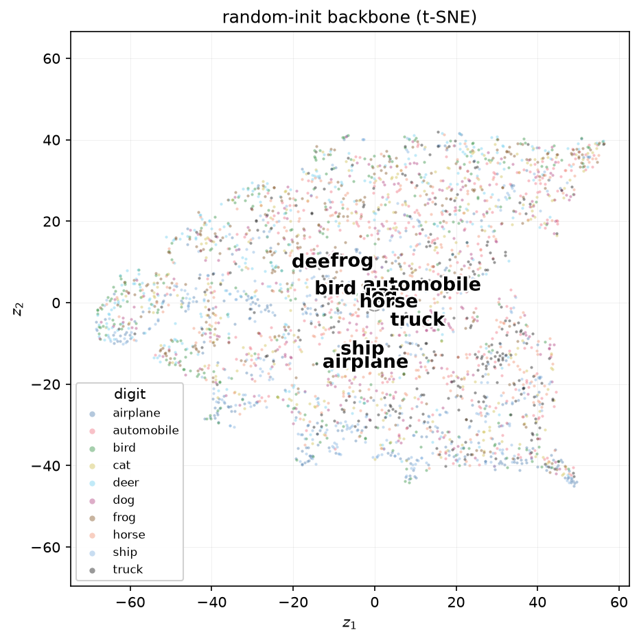
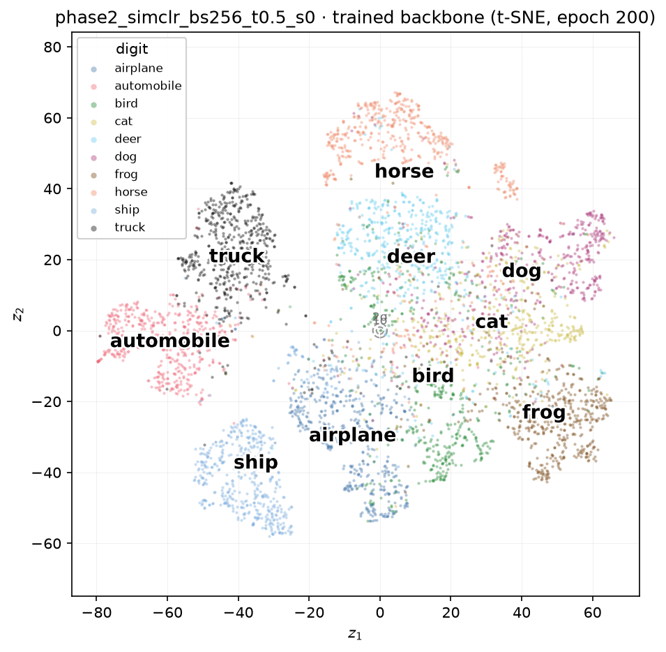
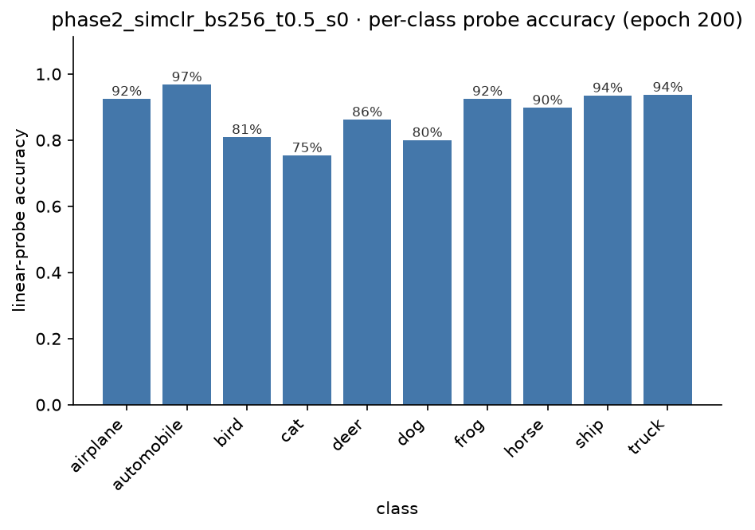

# Inside SimCLR: What a Contrastive Objective Actually Learns

[Earlier](2026-08-01-inside-a-vae.md) we asked what a *generative* objective keeps: train a VAE to reconstruct MNIST digits from a two-dimensional bottleneck, and about thirty dimensions' worth of shared structure survives while the rest gets discarded. That post closed with an obvious next question — what does a completely different objective keep, one with no decoder and no pixels to rebuild at all, just the constraint that two views of an image should agree? [SimCLR](2026-08-05-self-supervised-learning.md), the simplest contrastive method, is where we actually build that and observe.

<!-- more -->

The setup is a bigger step up from MNIST. CIFAR-10 is 60,000 real colour photographs — ten classes, 32×32 pixels, three channels — and unlike the VAE, there is no reconstruction signal at all to lean on. The only training signal is: *two augmented crops of the same photo should end up close together in representation space, and every other photo in the batch should end up far away.* No labels enter that training anywhere.

## The setup

The backbone is a ResNet-18 with one deliberate adaptation. The standard ImageNet stem — a 7×7 stride-2 convolution followed by a stride-2 max-pool — throws away most of a 32×32 image before the first residual block ever sees it, so it is swapped for a single 3×3 stride-1 convolution with no pooling. The rest is the usual four residual stages, ending in a 512-dimensional vector after global average pooling. That 512-d vector *is* the representation for everything that follows.

On top of it sits a small, disposable projector — `Linear → BatchNorm → ReLU → Linear`, 512 → 512 → 128 — used only during training and thrown away afterwards. The contrastive loss is computed on the projector's 128-d output, not the backbone's 512-d one, so that the pressure to discard augmentation-sensitive information (colour, if colour jitter is in the recipe) lands on the disposable head rather than the representation we actually care about.

Trained for 200 epochs, batch size 256, SGD with momentum and a cosine schedule with linear warm-up. As with the VAE, **the model never sees a single label during training** — worse than the VAE, in fact, since it does not even know which photos share a class, only which crops came from the same source image.

???+ info "The collapse-proof, and its sanity check"

    The trivial failure mode for this objective is mapping every image to the same constant vector — every pair would then match perfectly. NT-Xent makes that solution actively bad: with equal representations, the "correct" positive is indistinguishable from every negative, and a 2N-way softmax over indistinguishable candidates scores $\log(2N-1)$ nats, the *worst* value the loss can take, not the best. That is also the exact number the loss should read at random initialisation, since untrained embeddings point in roughly random directions. Ours came in at **6.231**, against a predicted **6.236** — a clean confirmation the wiring is right, the same role the ~540-nat check played for the VAE.

## The floor

Before training buys anything, how much does the architecture alone give away for free? A completely untrained, randomly-initialised backbone still has convolutional structure — local receptive fields, translation equivariance — so its features are not noise.

A linear probe on these random features reaches **37.9%** (a ten-class problem, so chance is 10%), and a k-NN classifier reaches **28.6%**. Diffuse, weakly separated — but not nothing. This is the number every trained method has to clear by a wide margin, exactly as the untrained VAE's ~543-nat reconstruction cost was the number training had to beat.

## Training, and a loss curve worth distrusting

NT-Xent drops sharply during the ten-epoch warm-up, then spends the remaining 190 epochs grinding down slowly from about 4.7 to 4.48 — never getting close to zero, and looking almost flat for long stretches.

???+ info "Why the loss looks flat while the model keeps improving"

    NT-Xent's floor is nowhere near zero. Even a *perfect* representation still has to win a genuinely hard 511-way classification every batch, so the loss saturates at some non-trivial value that has little to do with representation quality past a point. Over the stretch where our loss moved from 4.70 to 4.48 — barely shifting — the linear probe climbed from **77.9% to 88.1%**, a ten-point gain in exactly the region the loss curve looks asleep. The loss is a training signal, not the yardstick; the probe is.

## Does it actually work?

| | random floor | SimCLR, 200 epochs |
| --- | --- | --- |
| linear probe | 37.9% | **88.1%** |
| k-NN | 28.6% | **86.6%** |

More than double the floor on both metrics — a healthy, unremarkable-in-the-best-sense result for this scale. The more interesting number is how the *gap* between those two metrics moved over the course of training:

| epoch | probe | k-NN | gap |
| --- | --- | --- | --- |
| 1 | 53.7% | 46.0% | 7.8 pts |
| 8 | 71.5% | 64.4% | 7.1 pts |
| 32 | 77.9% | 73.3% | 4.6 pts |
| 128 | 85.3% | 82.4% | 2.9 pts |
| 200 | 88.1% | 86.6% | 1.6 pts |

???+ info "Why the k-NN gap closes"

    A linear probe *fits* new weights to whatever the features look like, so it can always find some useful direction even in a fairly disorganised space. k-NN fits nothing — it just asks which training images are nearest in raw Euclidean distance, and that is only a good question once training has actually reshaped the geometry so that "nearby" means "similar." Watching the two metrics converge is a free, parameter-free signal that the representation is becoming genuinely organised, not just linearly decodable by an adaptive classifier.

## The scatter, before and after

Encoding the test set through the trained backbone and projecting to two dimensions with t-SNE gives the direct counterpart to the random-init picture above.

Ten classes, never named during training, falling into their own visibly separated regions purely from the constraint that crops of the same photo agree and crops of different photos disagree.

## The per-class picture

The aggregate numbers hide a shape worth pulling apart, since CIFAR-10's ten classes are not equally similar to each other — four are vehicles, six are animals.

| class | accuracy | most confused with |
| --- | --- | --- |
| automobile | 96.8% | truck (2.5%) |
| truck | 93.7% | automobile (4.4%) |
| ship | 93.5% | airplane (2.8%) |
| airplane | 92.5% | ship (2.4%) |
| frog | 92.5% | cat (2.6%) |
| horse | 89.8% | deer (2.9%) |
| deer | 86.2% | bird (4.2%) |
| bird | 80.9% | deer (5.6%) |
| dog | 80.0% | cat (13.3%) |
| cat | 75.4% | dog (12.4%) |

Two things stand out. First, every single class's top confusion stays inside its own broad category — vehicles get mistaken for other vehicles, animals for other animals, with not one cross-category error appearing as anyone's leading mistake. That structure was never labelled; it fell out of an objective that only ever asked "is this the same photo or not."

Second, one pair is a clear outlier: cats and dogs confuse each other at 12–13%, three to five times the rate of every other pair, and — tellingly — almost symmetrically in both directions. This is the CIFAR-10 analogue of the VAE's MNIST 4/9 tangle, and it is worth being honest about what it is not: not a SimCLR weakness. Cat-versus-dog is the notoriously hardest pair in CIFAR-10 for nearly every architecture ever thrown at it, contrastive or supervised, because the two classes share pose, indoor/outdoor context, texture, and scale far more than any other pair in the dataset.

## What a contrastive representation keeps

The VAE kept whatever a two-dimensional bottleneck needed to rebuild pixels — a compressed, generative summary. SimCLR keeps whatever survives augmentation and still tells 512 numbers apart from 511 near-neighbours in a batch — a discriminative summary, built with no reconstruction signal and no labels of any kind. Different objective, different mechanism, no decoder anywhere in sight — and yet the *shape* of what emerged rhymes: clean separation for the visually distinctive classes, and one genuinely hard, symmetric tangle for the classes that legitimately look alike.

The natural next question is whether that shape is a property of the data, or an accident of how SimCLR happens to avoid collapse. [SimSiam and VICReg](2026-08-08-barlow-twins-vicreg.md) avoid the exact same trivial solution through completely different mechanisms — no negatives anywhere — and building them next means we get to break each one on purpose: pull the stop-gradient out of SimSiam, zero out VICReg's variance term, and watch collapse happen in real time rather than just reading that it should.
