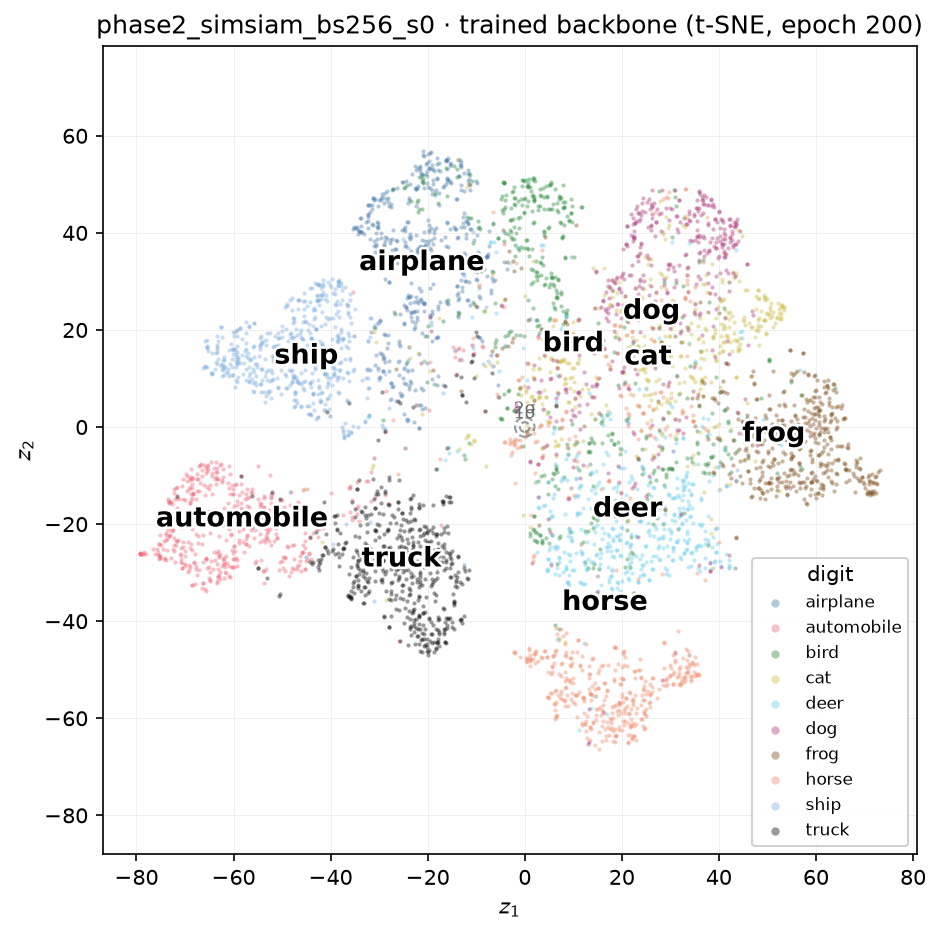
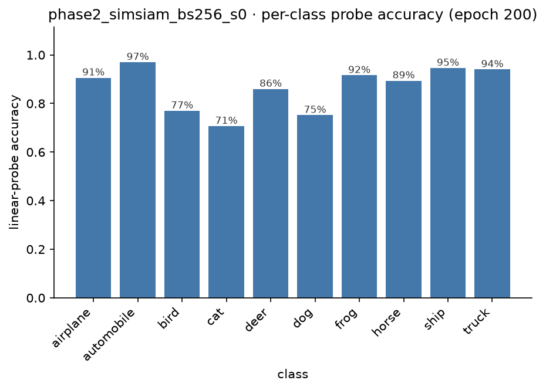
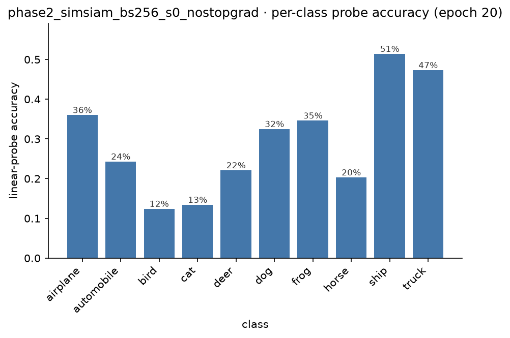
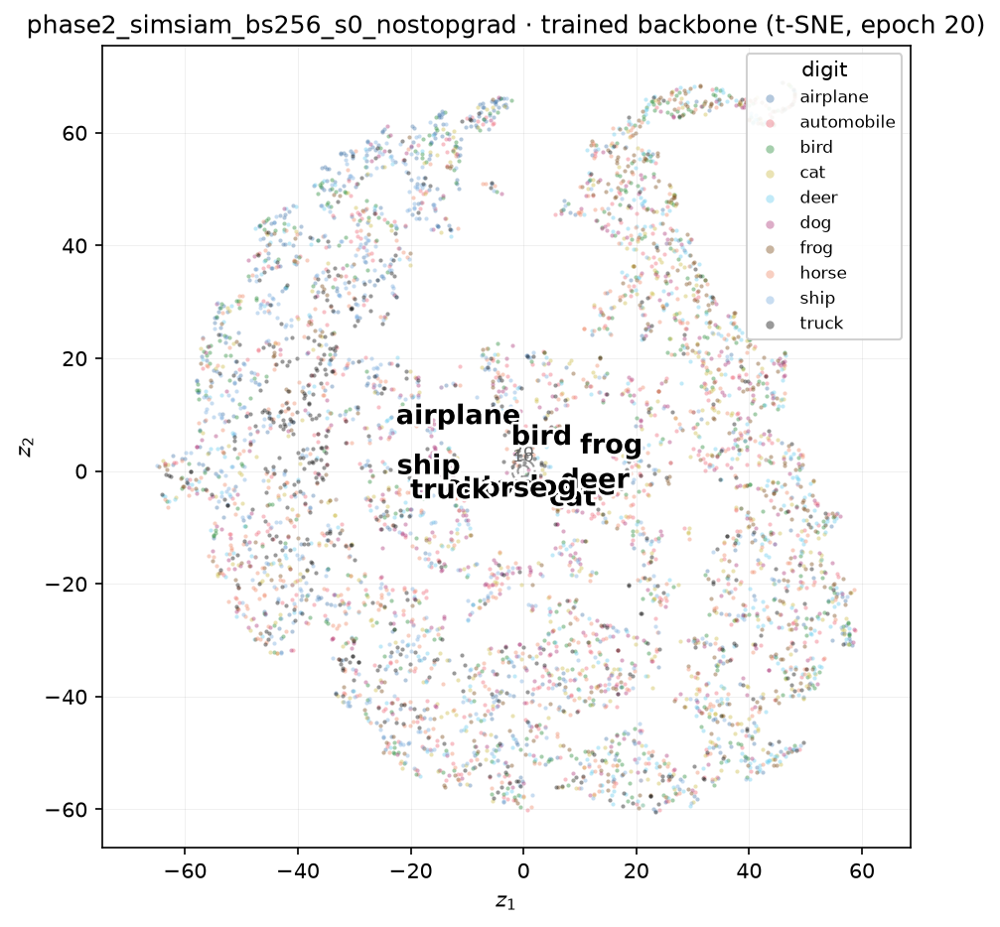
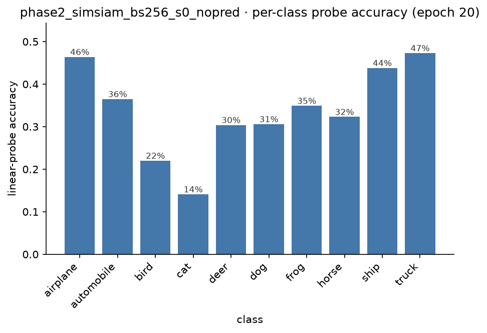
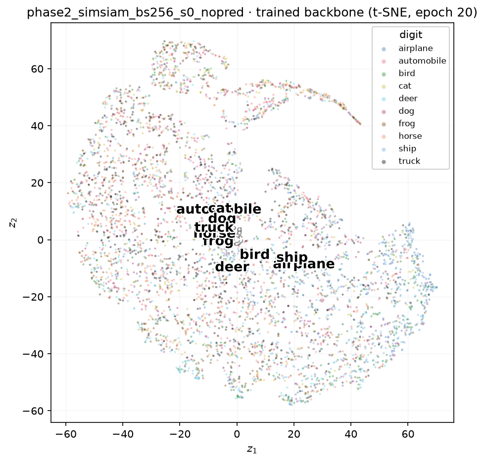

# Seeing Inside SimSiam: What a Non-Contrastive Objective Learns, and How It Breaks

[SimCLR](2026-08-15-inside-simclr.md) prevents representation collapse with negatives: every other image in the batch is actively pushed away, so mapping everything to one point makes the loss worse, not better. [SimSiam](2026-08-05-self-supervised-learning.md) has no negatives at all — no queue, no momentum encoder, nothing pulling different images apart. Its only defence is architectural: a predictor on one branch, and a stop-gradient on the other. That is a strictly weaker-sounding safety net, and it raises an obvious pair of questions. Does it actually work? And what happens if we take the safety net away?

<!-- more -->

## The setup

Same backbone as SimCLR — the CIFAR-adapted ResNet-18, 512-d output — same augmentation pipeline, same CIFAR-10 data, same batch size (256) and optimiser (SGD, cosine schedule with warm-up), deliberately matched so the *only* thing that differs between the two experiments is the anti-collapse mechanism itself.

On top of the backbone sits a 3-layer projector (`Linear → BN → ReLU`, twice, then a final `Linear → BN` with no learnable affine parameters — a specific detail from the original paper's own implementation) and a 2-layer bottleneck predictor (`Linear → BN → ReLU → Linear`, 128 → 64 → 128). The loss is symmetrised negative cosine similarity: each branch's *prediction* is matched against the *other* branch's *target*, with the target detached from the graph so no gradient flows back into it.

$$
\mathcal{L} = \tfrac{1}{2}\big[D(p_1, \operatorname{sg}(z_2)) + D(p_2, \operatorname{sg}(z_1))\big], \qquad D(p, z) = -\frac{p}{\lVert p\rVert}\cdot\frac{z}{\lVert z\rVert}
$$

That `sg` — stop-gradient — is the entire mechanism. Nothing else in this objective prevents collapse.

???+ info "A different init check, on purpose"

    NT-Xent's random-init value was $\log(2N-1)$ — a large positive number, the *worst* possible score, which is what makes contrastive collapse structurally impossible. SimSiam's loss is bounded in $[-1, 1]$, and at init, with $p$ and $z$ pointing in roughly random directions, cosine similarity concentrates near zero — so the expected value is close to **0**, not the worst score on the scale. Ours read **0.085**. That difference matters: a loss near its floor at init doesn't mean anything is wrong here, but it does mean the loss alone will never be enough to distinguish a healthy run from a broken one — more on that shortly.

## Does it actually match SimCLR?

| | random floor | SimCLR, 200 epochs | SimSiam, 200 epochs |
| --- | --- | --- | --- |
| linear probe | 37.9% | 88.1% | **86.6%** |
| k-NN | 28.6% | 86.6% | **85.0%** |

Within a point and a half of SimCLR on both metrics, with an objective that never once compares one image to another. This is exactly what should be expected going in — a non-contrastive mechanism isn't a *better* answer to collapse than a contrastive one, just a *different* one, so parity rather than a clear win is the honest prediction. It's still worth pausing on: an objective that never explicitly says "these two images are different" produces a representation that separates ten classes almost as well as one that does, purely from getting the optimisation dynamics right.

## The remarkable part: the same map, drawn twice

The aggregate numbers being close is one thing. What the per-class breakdown shows is more interesting.

| class | SimCLR accuracy | SimSiam accuracy |
| --- | --- | --- |
| automobile | 96.8% | 97.0% |
| truck | 93.7% | 94.0% |
| ship | 93.5% | 94.6% |
| airplane | 92.5% | 90.6% |
| frog | 92.5% | 91.6% |
| horse | 89.8% | 89.4% |
| deer | 86.2% | 86.0% |
| bird | 80.9% | 77.0% |
| dog | 80.0% | 75.2% |
| cat | 75.4% | 70.7% |

Almost the identical ranking, class for class, from two objectives that share no design principle. And it goes deeper than the ranking: in *both* runs, independently, **every single class's top confusion stays inside its own broad category** — vehicles only ever get mistaken for other vehicles, animals only for other animals, with zero exceptions across twenty rows. And in both runs the single hardest pair is the same one: cats and dogs, confused with each other three to five times more often than any other pair, and confused almost symmetrically in each direction (SimCLR: 12.4% / 13.3%; SimSiam: 13.2% / 15.3%).

Two mechanisms that don't agree on how to prevent collapse arrived at the same picture of what's easy and what's hard. That's evidence the structure being found here is a property of the data — of how visually similar CIFAR-10's classes genuinely are to each other — rather than an artefact of either training procedure.

Ten classes, well separated, purely from an objective that never once looked at another image in the batch.

## The one thing SimCLR can't show you

SimCLR structurally cannot collapse: mapping every image to the same vector makes the negatives-based loss *worse*, so gradient descent is pushed away from that solution automatically. SimSiam's non-collapse isn't loss-driven at all — it's a side effect of the stop-gradient asymmetry, which means it is possible, on purpose, to remove it and watch the trivial solution win.

Doing that exposes something worth knowing before it happens: **the loss cannot tell you when this has gone wrong.**

| epoch | healthy loss | broken loss (no stop-gradient) |
| --- | --- | --- |
| 1 | −0.60 | −0.80 |
| 2 | −0.75 | −0.98 |
| 4 | −0.70 | −0.98 |
| 8 | −0.76 | −0.98 |
| 16 | −0.82 | −0.99 |

Both curves are deeply negative by epoch 16. If anything, the broken run's loss looks *more* converged. Watching only the loss, this run would read as a clean success — arguably a better one than the healthy run, since it's closer to the theoretical floor of −1.

The number that actually tells the story is the **effective rank** of the representation — how many of the backbone's 512 output dimensions carry independent information, measured as $(\sum \lambda_i)^2 / \sum \lambda_i^2$ over the covariance eigenvalues $\lambda_i$. It is bounded in $[1, 512]$: 1 means every image maps to (almost) the same vector, 512 means all 512 dimensions carry equal, independent variance.

???+ info "Why not just threshold the raw variance?"

    The obvious first attempt — count dimensions whose raw variance across the dataset exceeds some cutoff — turns out to fail here for two compounding reasons. First, a cosine-similarity loss is invariant to the overall *magnitude* of the backbone's output, so weight decay steadily shrinks that magnitude over hundreds of epochs with nothing anchoring it, driving every dimension's raw variance toward zero even while the representation's *direction* — the only thing the loss and the linear probe actually use — stays fully informative. Second, and more fundamentally, a fixed threshold doesn't generalise across dimensionality at all: a healthy, isotropically-spread 512-d vector has roughly $1/512$ of its variance in each individual dimension purely from being spread over 512 directions, comfortably under any threshold calibrated for a much lower-dimensional space. The eigenvalue ratio above sidesteps both problems at once — multiplying every feature by a constant leaves the ratio exactly unchanged, and it needs no threshold to calibrate in the first place.

Healthy SimSiam's effective rank, checked at epoch 200: **31.1 out of 512** — not maximally spread, but nowhere near collapsed, and in a similar ballpark to the ~30 active dimensions [the VAE](2026-08-01-inside-a-vae.md) found useful for a completely different dataset and objective, a resonance worth noting without over-reading it. The broken run, with the stop-gradient removed:

| epoch | 1 | 2 | 4 | 8 | 16 | 20 |
| --- | --- | --- | --- | --- | --- | --- |
| effective rank | 1.19 | 1.24 | 1.07 | 1.52 | 1.00 | 1.03 |

Pinned at the collapsed end of the scale from the very first epoch onward. Two objectives with loss curves that look, if anything, more converged than the healthy run's — and a representation that never once escaped total collapse.

## Worse than doing nothing at all

The linear probe over the same run tells the sharpest version of this story:

$$
40.5\% \rightarrow 41.6\% \rightarrow 36.2\% \rightarrow 34.4\% \rightarrow 30.0\% \rightarrow \mathbf{29.4\%}
$$

Not flat — declining. And the final number, **29.4% linear probe / 25.3% k-NN**, sits *below* the completely untrained, random-initialisation floor of 37.9% / 28.6% from the very first experiment in this series. Twenty epochs without the stop-gradient didn't just fail to learn — they actively destroyed the crude signal a random network already provided for free, because once the target branch stops holding still, minimising the loss and minimising usefulness point in the same direction.

The per-class picture confirms the failure is structural, not just a uniform drop in accuracy. In the healthy runs, confusion was localised — nearly every class under 5%, with cat/dog as the one clear exception, and the vehicle/animal boundary held without a single crossing. In the collapsed run, every class shows substantial confusion (12% to 27%), and that boundary breaks down too: horse's top confusion becomes **truck** (19.1%) — an animal mistaken for a vehicle, something that never happened once across either healthy run. Collapse doesn't just erode fine-grained accuracy; it erases the coarse structure underneath it as well.

???+ info "Why the scatter above might look less collapsed than the number says"

    t-SNE is built specifically to find and exaggerate whatever local structure exists, however faint. An effective rank of 1.0 is not mathematically *exactly* one dimension — a small residual direction survives, plausibly tracking something coarse like colour or brightness statistics — and t-SNE will happily seize on that faint signal and render it as visible grouping. Trust the effective-rank number over the picture here: the raw 512-dimensional representation is far more collapsed than a quick glance at this plot would suggest.

## A second, independent way to break it

Removing the stop-gradient isn't the only way to collapse SimSiam. The predictor exists specifically to give the "predicting" branch a role the target branch doesn't share — swap it for the identity function ($p = z$) and that asymmetry disappears too, even with the stop-gradient still in place.

This ablation starts from a worse position than the first one. Even a completely untrained backbone produces highly correlated outputs for different random images — a known signal-propagation artefact of deep, untrained CNNs, unrelated to SimSiam itself — so with no predictor to break that symmetry, the loss sits close to its collapsed value before a single gradient step is taken.

| epoch | 1 | 2 | 4 | 8 | 16 | 20 |
| --- | --- | --- | --- | --- | --- | --- |
| effective rank | 1.04 | 1.04 | 1.17 | 1.34 | 1.15 | 1.08 |

Pinned even tighter to the collapsed floor than the stop-gradient ablation was, from the very first checkpoint onward. Final numbers: **33.8% linear probe, 27.8% k-NN** — again below the untrained random floor, again a representation actively made worse than doing nothing at all.

The per-class picture adds two findings that are only visible once there are two independently broken runs to compare.

First, one specific confusion recurs in both: horse's top confusion is truck in the stop-gradient ablation, and it's truck again here. Two unrelated ways of breaking the same model landed on the exact same cross-category mistake — unlikely enough to be a coincidence, and worth a guess rather than a shrug: whatever faint residual signal survives total collapse in either failure mode may be tracking something crude like colour or outdoor-background statistics, similar enough between horses and trucks to survive even when everything else is destroyed.

Second, and more surprising: this run's aggregate accuracy (33.8%) is *higher* than the stop-gradient ablation's (29.4%), but its coarse category structure is *more* broken, not less — two cross-superclass confusions here (`bird → airplane` joins `horse → truck`) against only one in the other ablation. Aggregate accuracy and structural integrity are not the same axis. A collapsed representation can claw back a point or two of raw accuracy by spreading its one surviving direction a little more evenly across classes, while simultaneously losing more of the coarse boundary that both healthy runs preserved without a single exception. Reading only the headline probe number would rank this run as the less damaged one; the per-class picture says the opposite.

## What the break-it experiment teaches

SimCLR and SimSiam, run honestly, land in the same place by two unrelated routes — genuine evidence that what's being discovered is a fact about the data, not a quirk of either method. But only one of them can be taken apart to show *why* it works: pull out either half of the asymmetry that prevents collapse — the stop-gradient or the predictor — and a representation that matched SimCLR almost point for point collapses to a single effective dimension, twice over, in two different ways, while its training loss quietly insists everything is fine both times. The lesson generalises past this one architecture — whenever a loss curve and a representation-space diagnostic can disagree, the loss curve is not the thing to trust.

[VICReg](2026-08-08-barlow-twins-vicreg.md) is next, and it gets its own version of this experiment: rather than an architectural asymmetry, its anti-collapse mechanism is an explicit variance term in the loss, and it can be broken just as directly — zero out that one term and watch the same story play out through a completely different mechanism again.
