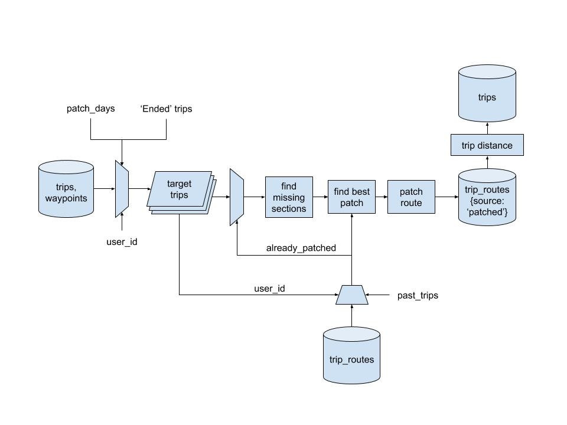

If we could reliably determine the probable source and destination of a drivers journey, it could help us tackle a number of problems associated with unreliable or inaccurate GPS traces. It would also be useful in extracting information about trip types and patterns related to trip geography. Here we discuss isolating frequent destinations of a user from a database of historic trips that the user has made over the past few weeks.

#### Identifying trip end points
To solve the problem we need to have a catalog of trips. The initial algorithm used to idetify trips could be as simple as using a fixed `dwell_time` which defines a trip boundary. If a user stays at a location for more than the defined `dwell_time`, we could mark the trip as completed.

These are all the trips made in the past 10 weeks by a user. We only need the trip end points for our algorithm.

#### Clustering
The clustering algorithm takes the geographic location of all the trip end-points and clusters them into groups based on certain criteria. There are several unsupervised machine learning algorithms one can use for clustering, depending on the particular problem one is trying to solve. For our problem, we do not know apriori the number of clusters into which we want to organize our locations. The algorithm we use is the [**density based scan (DBSCAN)**](http://scikit-learn.org/stable/modules/clustering.html#dbscan). 

The granularity of the clustering is programmed by passing the `radius` of the potential clusters to the algorithm. It then clusters our end-points into minimal clusters satifying the condition that:

  * every cluster has an associated central point (centre of gravity)
  * every end-point is within the provided `radius` of the center of the cluster

