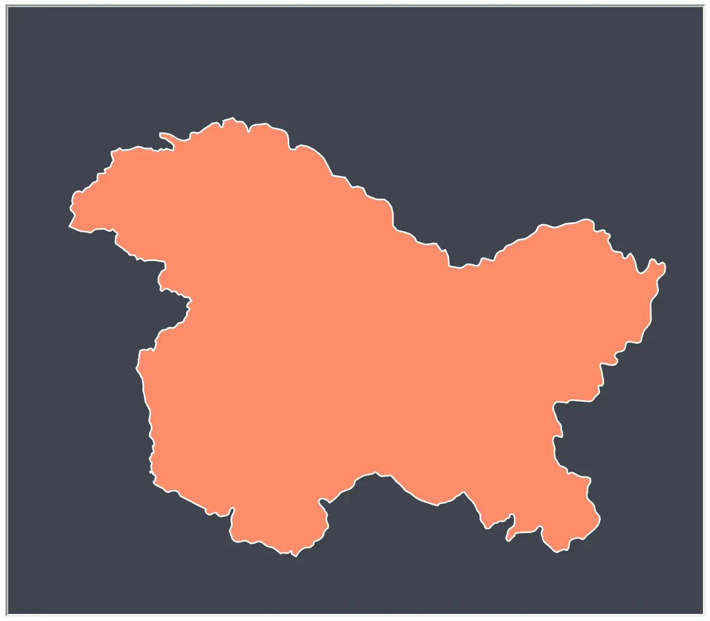

Obtaining a reliable map of India is a challenge because of the status of disputed territories and their interpretation by different sources. The main difficulty is in combining the different regions of Jammu and Kashmir which are controlled by three different countries namely India, Pakistan and China. Here we attempt to generate a single GeoJSON to include the entire state of Jammu and Kashmir as acceptable under the rules laid down by the government of India for use within the country.

<!-- more -->

#### The source
The original maps here are from [Natural Earth](http://www.naturalearthdata.com). The region controlled by India is available from the administrative map of India, while the rest of the areas are available from the map of disputed territories.

#### Conversions
The shapefiles downloaded from Natural Earth are first converted to GeoJSON using [ogr2ogr](http://www.gdal.org/ogr2ogr.html).
```
ogr2ogr -f GeoJSON -where "ADM0_A3 IN ('IND')" \
        india_states.json shapefile.shp
```
A similar procedure is done for the disputed territories and the relevant subunits are isolated.

#### Rendition

The disputed territories occupied by other countries are first isolated.


These occupied territories are then merged with the region of Jammu and Kashmir under Indian control.


The superpolygon is then obtained which is the official bound of the Indian state of Jammu and Kashmir.



#### Source Code
The code and the results can be viewed at [**GitHub**](https://gist.github.com/anilnairxyz/9148bbbd31b00fabc3ef2a34c8aaa9b6) or [**bl.ocks**](https://bl.ocks.org/anilnairxyz/9148bbbd31b00fabc3ef2a34c8aaa9b6)
