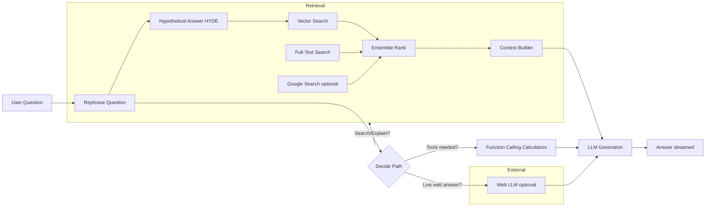
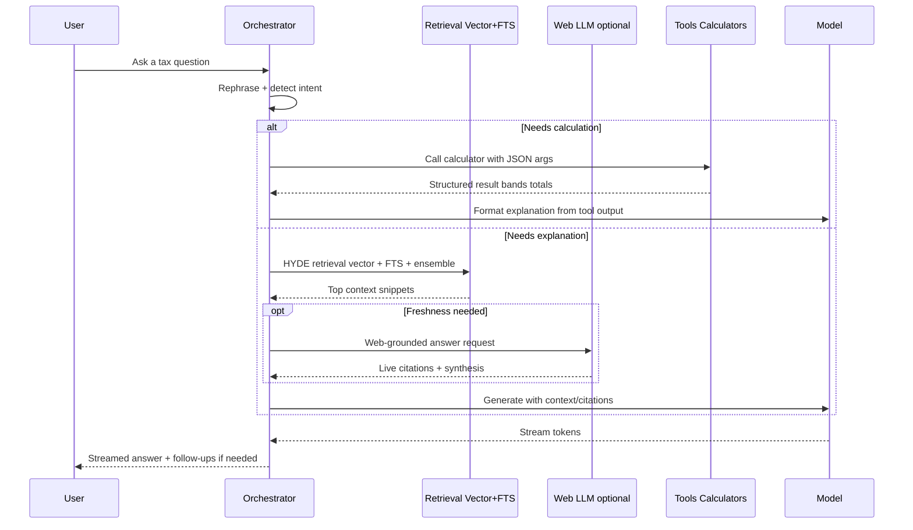

# Building a Tax Copilot: A Practical Guide to Trustworthy AI for Tax Questions

Modern language models can converse fluently, but trustworthy answers to tax questions require more than eloquence. This post outlines a pragmatic, production-oriented approach to building a tax copilot that answers questions and performs calculations reliably. It focuses on the technology and the philosophy behind the system, not any specific implementation details.

<!-- more -->

The key ideas:

- Retrieval-Augmented Generation (RAG) to ground the model’s answers in relevant documents.
- HYDE (Hypothetical Document Embeddings) to improve retrieval quality.
- A vector database (plus Full-Text Search) to organize knowledge.
- Optional web-grounded responses via a browsing LLM.
- Tool-augmented generation for accurate tax calculations.
- Guardrails, analytics, and cost/latency awareness to keep the system robust.

## Why a “Tax Copilot”?

Tax rules are nuanced. People ask natural, messy questions: they combine multiple incomes, special allowances, edge cases, and what-ifs. A tax copilot should:

- Provide clear, accurate explanations with citations.
- Perform calculations (e.g., capital gains tax, take-home pay) reliably and explain the math.
- Ask clarifying questions when information is missing or ambiguous.
- Minimize hallucinations by grounding answers in trusted sources.

## Architecture at a Glance

At a high level, the copilot either (a) executes a tool (calculator) when it detects a computational task, or (b) retrieves relevant context and explains the answer, optionally using a browsing LLM for live web-grounded responses.

## Retrieval‑Augmented Generation (RAG)

RAG reduces hallucinations by giving the model a curated context:

- Embed documents (help articles, tax guides, FAQs) into vectors. Store in a vector database.
- At question time, retrieve the most similar snippets to build a context prompt.
- Ask the model to answer using that context; cite URLs where possible.

Practical tips:

- Chunking: Prefer chunks that preserve semantic coherence (entire short articles are often better than many tiny slices). Use metadata (source, URL, tags, timestamps).
- Hybrid retrieval: Pair vector search with Full‑Text Search (FTS). FTS catches exact matches (rates, codes, acronyms) that vectors may miss.
- Ensemble ranking: Combine signals (vector scores, FTS ranks, recency, source trust) into a final ranked list.

## HYDE: Hypothetical Document Embeddings

HYDE improves retrieval by embedding a hypothetical answer, not just the question:

- Step 1: Rephrase the question to be standalone (remove chat dependencies).
- Step 2: Generate a short hypothetical answer.
- Step 3: Retrieve documents similar to this hypothetical answer.

Why it helps: documents in “answer space” are often more coherent than documents matched to short, ambiguous questions. HYDE is a technique from research, implemented here using standard LLMs for the rephrase/answer steps.

## Vector Database + FTS

- Vector DB: Stores dense embeddings for semantic similarity. Great for matching concepts even when wording differs.
- Full‑Text Search: Fast keyword search with ranking; excellent for exact terms (thresholds, bands, statutory phrases).
- Use both: Build a hybrid retrieval layer and ensemble-rank the results. It significantly improves relevance and trust.

## Optional Web‑Grounded Answers

Sometimes the best answer is on the open web (e.g., brand‑new guidance). You can:

- Call a browsing LLM (e.g., Perplexity’s API) that fetches sources and synthesizes an answer.
- Or run a lightweight “search + fetch + extract” pipeline with a curated set of domains.

Use this path selectively:

- Favor internal knowledge for stability and consistency.
- Use web answers when freshness is critical; clearly cite sources.

## Tool‑Augmented Generation (Calculators)

For tax, “do the math” is crucial. Relying on the model to calculate is risky. Instead:

- Define calculators as tools (functions) with strict JSON schemas (inputs, constraints, descriptions).
- Let the model choose and call tools (function calling) when the user asks for a computation.
- Return structured outputs (band splits, tax subtotals, totals) and post‑process into human explanations.
- Ask clarifying questions if required inputs are missing or ambiguous.

Example tools (illustrative, not exhaustive):

- Capital gains tax
- Take‑home pay / income tax / National Insurance
- Tax‑free allowance
- Mortgage amortization

Guardrails:

- Instruct the model to explain results from tool outputs only—no “freehand” math.
- Validate inputs against the schemas; handle errors gracefully and request clarification.

## Orchestration Loop (Plain‑English Policy)

- Rephrase the user’s question and remove chat dependencies.
- If the question implies a calculation, select an appropriate tool and execute.
- If the question seeks explanation, retrieve context using HYDE + hybrid search.
- If web freshness is necessary, consider a web‑grounded path.
- Generate and stream the answer. Include citations when available.
- If anything is missing/ambiguous, ask for clarification.

## Observability, Guardrails, and Costs

- Observability: Track token usage, response times, and failure modes. Aggregate per feature and per model to tune prompts and routing.
- Guardrails: System prompts that forbid unsupported assumptions; input validation; clear error messaging.
- Latency: Stream tokens for perceived responsiveness. Limit context length, cache frequent embeddings, pre‑rank likely docs.
- Model routing: Use a primary/alternate model policy for cost vs. quality. Consider smaller models for classification/selection, larger for final answers.

## Privacy & Security

- Store only what you need (minimize PII). Mask or drop sensitive fields.
- Authenticate access to retrieval and tools. Use project‑scoped API keys and per‑environment secrets.
- Log safely (redact inputs/headers). Align with data retention policies.

## A Minimal End‑to‑End Flow

## Closing Thoughts

A credible tax copilot blends generative language with grounded knowledge and reliable tools. RAG reduces hallucination, HYDE improves retrieval, hybrid search increases recall, and calculators turn natural language into precise math. Add careful orchestration, observability, and principled guardrails—and you have an assistant that’s helpful, trustworthy, and fast enough to feel like magic.

***

???+ info "Notes"

- “HYDE” refers to Hypothetical Document Embeddings (research technique). Any modern LLM can generate the hypothetical answer used for retrieval.
- “Browsing LLM” denotes an API that integrates search + page fetching during generation; use judiciously.
